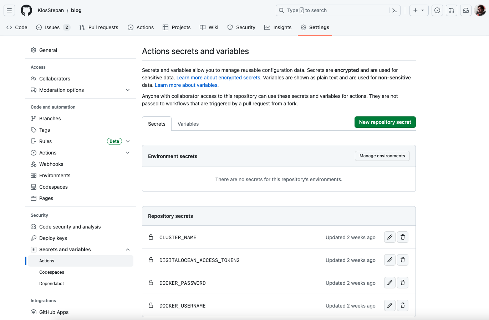

Continuous integration & Continuous delivery `CI/CD` can be very useful technique when used properly for automating mundane tasks in your development process.

In this post I will show you 3 different **workflows** (or pipelines) that serve different purposes:
1. CI pipeline for PHP application testing CRUD functionality,
2. CD pipeline for React.js frontend deployment into DOKS cluster,
3. Build pipeline for Nuxt(Vue.js) frontend and push into Azure ACR.

Each workflow is a scripted array of steps streamlinng some mundane process.
## 1. CI CRUD tests PHP pipeline
This workflow `on push to master` will: 
- `check out` project repository,
- runs container of `database server`,
- `create database schema` & loads sample data,
- `run tests`.
```yaml
name: PHP 7.4 Tests

on:
  push:
    branches:
      - master

jobs:
  test:
    runs-on: ubuntu-latest
    
    services:
      database:
        image: mysql:8
        env:
          MYSQL_ROOT_PASSWORD: my_secret_pass
        options: >-
          --health-cmd="mysqladmin ping"
          --health-interval=10s
          --health-timeout=5s
          --health-retries=3
        ports:
          - 3306:3306

    steps:
      - name: Checkout code
        uses: actions/checkout@v3

      - name: Set up PHP
        uses: shivammathur/setup-php@v2
        with:
          php-version: '7.4'
          extensions: mbstring, mysqli

      - name: Set env variables
        env:
          ACTIONS_ALLOW_UNSECURE_COMMANDS: 'true'
        run: |
          echo "::set-env name=DATABASE_HOST::0.0.0.0"
          echo "::set-env name=DATABASE_USER::root"
          echo "::set-env name=DATABASE_PASS::my_secret_pass"
          echo "::set-env name=DATABASE_NAME::database"
      
      - name: Load MySQL schema and data
        run: mysql -h ${DATABASE_HOST} -u ${DATABASE_USER} --password=${DATABASE_PASS} < ./_db/1_create_proc_schema_init_data.sql

      - name: Prepare env
        run: composer install --no-interaction --no-progress

      - name: Run PHPUnit
        run: vendor/bin/phpunit
```  
### Preview
Look at https://github.com/KlosStepan/SwimmPair-Www for inspiration how the workflow is run, tests are written and overall setup of this PHP project.
## 2. CD of React.js Gatsby blog into Kubernetes pipeline  
This workflow `on manual workflow dispatch`:
- `check out` project repository,
- `install dotctl` (DigitalOcean CLI),
- `build docker image`,
- logs in & `push into dockerhub`,
- (re)`deploy into DOKS`.  

In order to run script with `SECRETS` you need to have them added into the GitHub repository in the first place.
<p align="center">
  
</p>  

### GitHub Workflow
```yaml
name: Build->push->deploy 'my-blog' into DigitalOcean Kubernetes cluster

on:
  workflow_dispatch:

jobs:

  build-push-deploy:

    runs-on: ubuntu-latest

    steps:
    - name: Checkout repository
      uses: actions/checkout@v3

    - name: Install doctl
      uses: digitalocean/action-doctl@v2
      with:
        token: ${{ secrets.DIGITALOCEAN_ACCESS_TOKEN2 }}

    - name: Build Docker image
      run: docker build -t your_dockerhub/my-blog:$(echo $GITHUB_SHA | head -c7) .

    - name: Dockerhub login
      run: docker login --username ${{ secrets.DOCKER_USERNAME }} --password ${{ secrets.DOCKER_PASSWORD }}

    - name: Push image to Dockerhub
      run: docker push your_dockerhub/my-blog:$(echo $GITHUB_SHA | head -c7)

    - name: Update deployment file
      run: TAG=$(echo $GITHUB_SHA | head -c7) && sed -i 's|<IMAGE>|your_dockerhub/my-blog:'${TAG}'|' $GITHUB_WORKSPACE/config/deployment.yaml

    - name: Save DigitalOcean kubeconfig with short-lived credentials
      run: doctl kubernetes cluster kubeconfig save --expiry-seconds 600 ${{ secrets.CLUSTER_NAME }}

    - name: Deploy to DigitalOcean Kubernetes
      run: kubectl apply -f $GITHUB_WORKSPACE/config/deployment.yaml

    - name: Verify Deployment
      run: kubectl rollout status deployment/my-blog
```
### `$GITHUB_WORKSPACE`/config/deployment.yaml
```yaml
apiVersion: v1
kind: Service
metadata:
  name: my-blog-service
spec:
  type: ClusterIP
  ports:
  - port: 80
    targetPort: 8080
  selector:
    app: my-blog
---
apiVersion: apps/v1
kind: Deployment
metadata:
  name: my-blog
spec:
  replicas: 2
  selector:
    matchLabels:
      app: my-blog
  template:
    metadata:
      labels:
        app: my-blog
    spec:
      containers:
      - name: my-blog
        image: <IMAGE>
        ports:
        - containerPort: 8080
        env:
        - name: MESSAGE
          value: Hello from my-blog Deployment!
```
### Dockerfile
```Dockerfile
FROM node as build
WORKDIR /app
COPY . .
RUN npm install --legacy-peer-deps
RUN npm run build

FROM nginxinc/nginx-unprivileged
COPY --chown=nginx:nginx --from=build /app/public /usr/share/nginx/html
```

### Preview
To preview repository with all things described please look into https://github.com/KlosStepan/blog.
## 3. Build Nuxt (Vue.js) and push into Azure ACR  
This workflow `on manual workflow dispatch` will:
- `check out` project repository,
- `build docker image` of the application,
- `login into Azure` and `push image`.
### GitHub Workflow
```yaml
name: Build->push 'app-frontend' into Azure ACR 

on:
  workflow_dispatch:
  
jobs:

  build-push:

    runs-on: ubuntu-latest

    steps:
    - name: Checkout repository
      uses: actions/checkout@v3
      
    - name: Build Docker image of frontend as 'app-frontend'
      run: docker build -t ${{ secrets._AZURE_REGISTRY_URL }}.azurecr.io/app-frontend:$(echo $GITHUB_SHA | head -c7) .


    - name: Login into Azure
      uses: azure/docker-login@v1
      with:
        login-server: ${{ secrets.AZURE_REGISTRY_URL }}.azurecr.io
        username: ${{ secrets.AZURE_LOGIN }}
        password: ${{ secrets.AZURE_PASSWORD }}

    - name: "Push 'app-frontend' into Azure ACR"
      run: docker push ${{ secrets.AZURE_REGISTRY_URL }}.azurecr.io/app-frontend:$(echo $GITHUB_SHA | head -c7)
```
### Preview
This application is private, so no futher information are be shared. Some overall information is that Azur User `PUSH1` credentials have to be stored in GitHub `SECRETS` as well and the user must have limited rights to perform only these actions.
### Futher development
We intend to add deployment functionality by [performing a rolling update](https://www.google.com/search?client=safari&rls=en&q=kubernetes+rolling+deployments&ie=UTF-8&oe=UTF-8) into [Azure Kubernetes Service (AKS)](https://azure.microsoft.com/cs-cz/products/kubernetes-service) and we must extent `PUSH1` rights to do so. It is similar to `Workload #2`, the `blog` but `instead of DigitalOcean Kubernetes` into `Azure AKS`. 