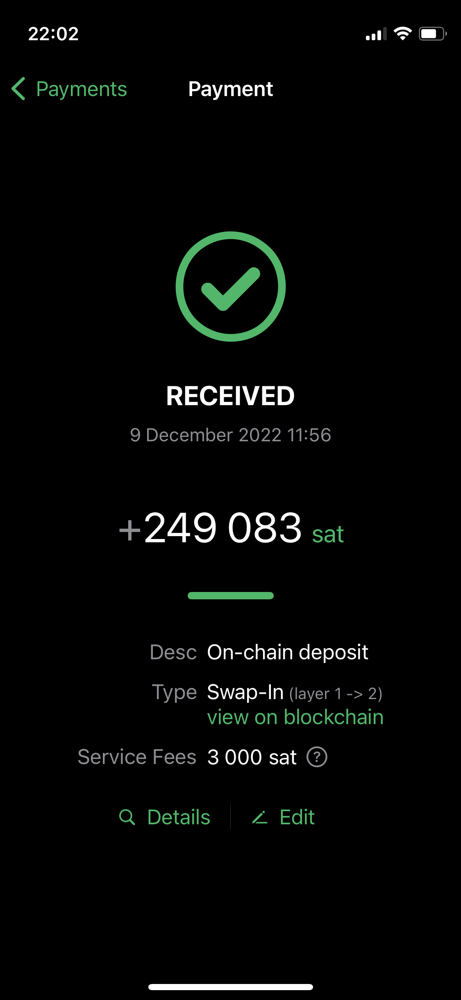
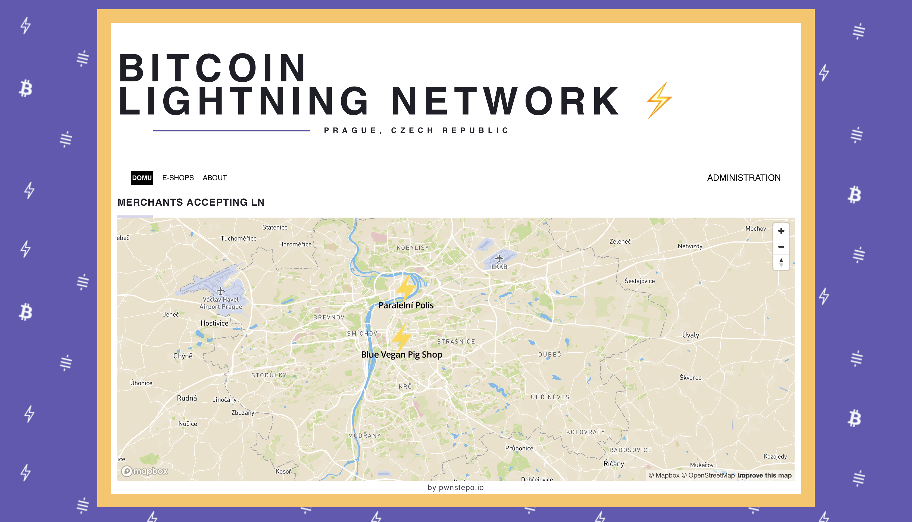
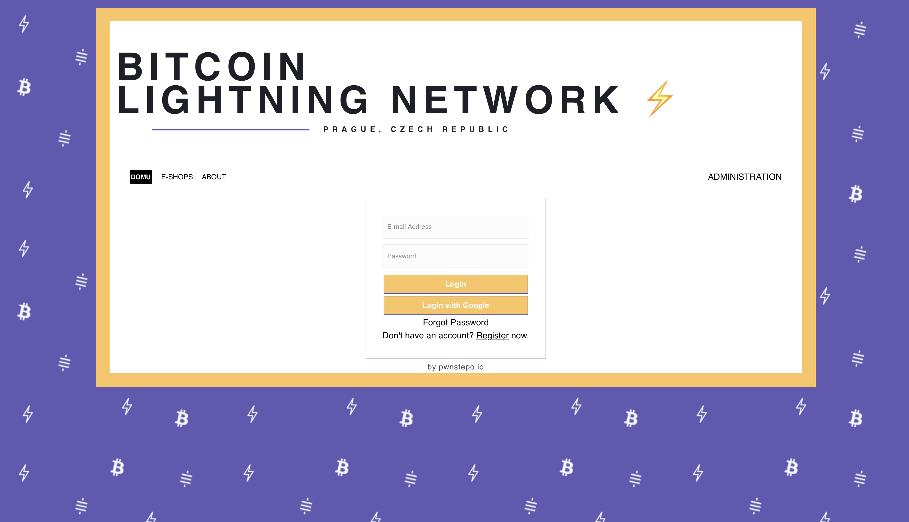
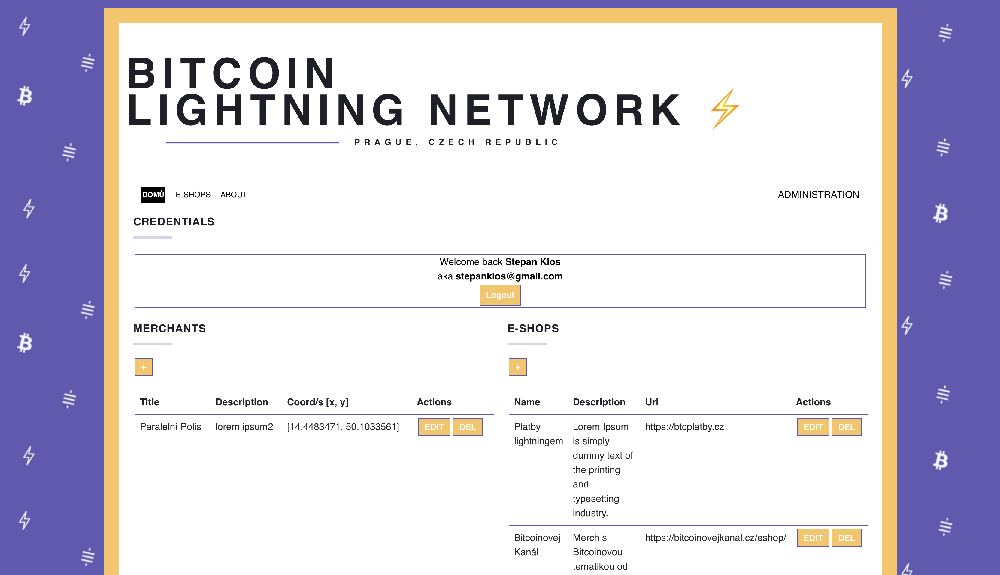
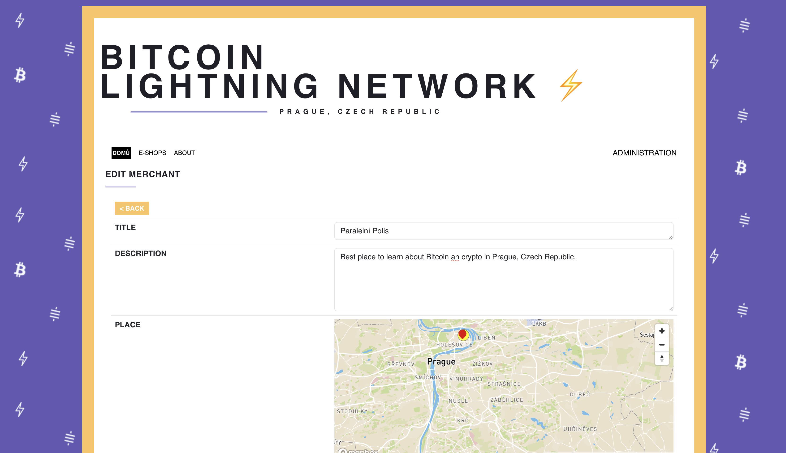

`Lightning Network` is now de-facto standard Layer 2 on the top of Bitcoin since 2019. One can use Layer 1 Bitcoin then swap it into Layer 2 for `instant` and `cheap` micropayments. 

  

 

 This opens avenue to using Bitcoin as convenient payment tool in everyday life. The question now is - where can we use it, so it makes my life easier?  
 
 There are various use cases that we might be interested in:
 - same city places & crypto fans accepting it,
 - travel to the other side of the world and pay with Lightning,
 - anonymous payments for wherever reason.

## Why Lightning map?
My idea was that we need to aggregate places and e-shop that accept Lightning Network together in one place.

My personal motivation was to:
- as a Lightning fan, I would know know where to use it,
- I help businesses to advertise, me & others to visit such places in Prague,
- add e-shops that sell goods on-line, which I am interested in as well.

For doing that I decided to create an MVP of how would such thing look like and work and maybe show this idea to others might be interested. I prototyped most important functionality with bare minimum tools. Now I only deploy frontend container to my DOKS for preview purposes.

#### Homepage

  

   

#### Login page (register&login / Google SSO)

  

 

#### Administration after Google SSO

  

   

#### Merchant edit

  

  

### Tech stack of MVP
For this MVP I used very straightforward set of tools (& stack) that has to be redesigned for sure. If you are interested, you can visit it http://lnmap.stkl.cz or see legacy GitHub repo https://github.com/KlosStepan/Lightning-map/tree/KlosStepan/mvp  

Quick prototyping stack is:
- React.js (Bootstrap),
- 17$ template https://themeforest.net/item/flatr-vcard-cv-resume-portfolio-template/21867659 ,
- MapBox,
- Firebase. 

These things are potentially dangerous:
- React.js should be used with MUI/RadixUI,
- Custom design has to be done,
- MapBox is expensive with traffic,
- Firebase is expensive with traffic.

The roadmap to a real project is: 
1. Get good design with more general targeting of Lightning topic.
2. Rewrite frontend to MUI (not necessarily full).
3. Ditch MapBox for free, yet highly customizable solution (as part of frontend works).
4. Provision infrastructure in `Google Cloud` via `Terraform`, which would contain managed Kubernetes, including `frontend` and `backend` workloads and managed MariaDB aside in Google Cloud. Use Firebase for bare minimum.
5. Write backend in Node.js or Go, potentially use Protocol Buffers for API definition.
6. Ditch Firebase for data storage (! define final structure to avoid migrations - `merchants`, `e-shops`) and attach backend to it.
7. Deploy whole project again to Google Cloud with `backend` and `MongoDB`.
8. Explore options of using Terraform not only for `infrastructure provisioning` but also for `Kubernetes managment`, most importantly redeploys, etc.
9. Use this Terraform replicability to run tests against this piece of software at testing environment.
10. Long live Lightning map!   

