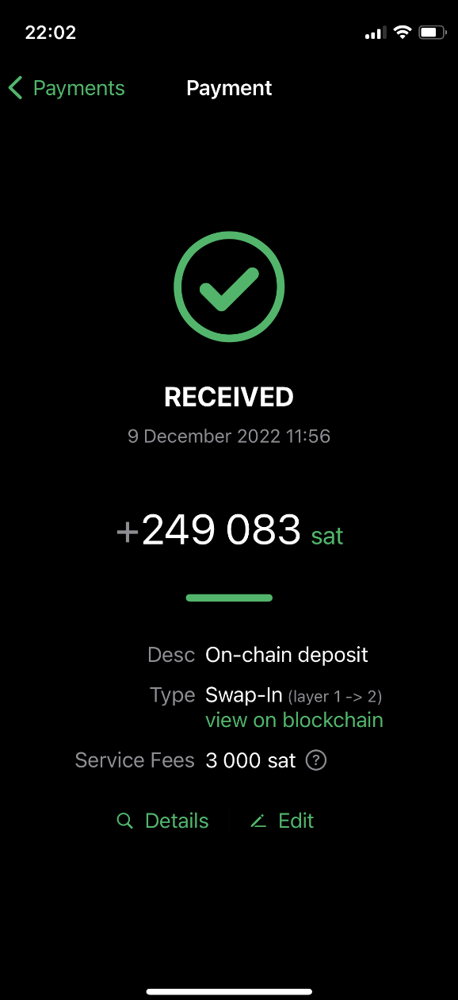
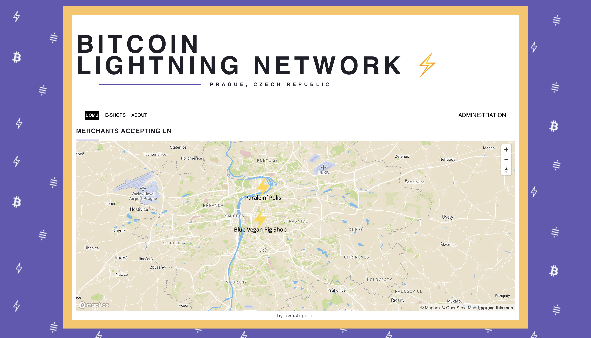
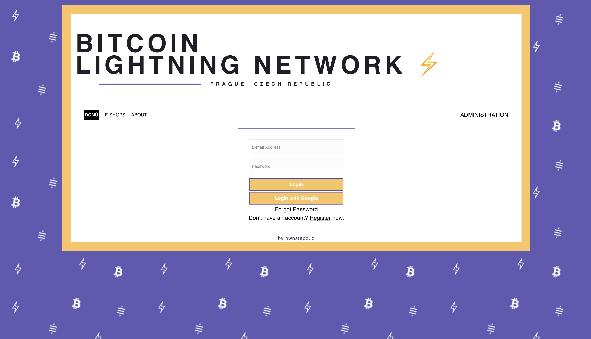
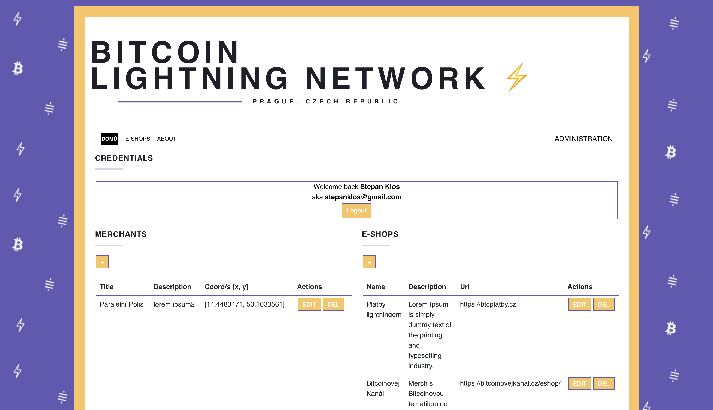
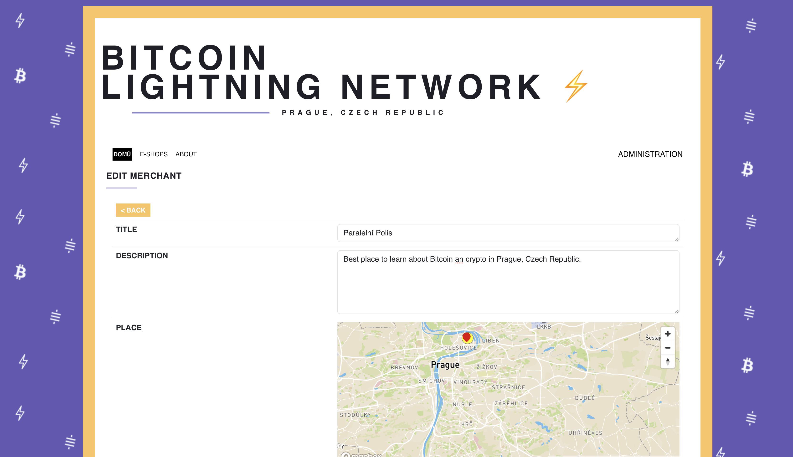
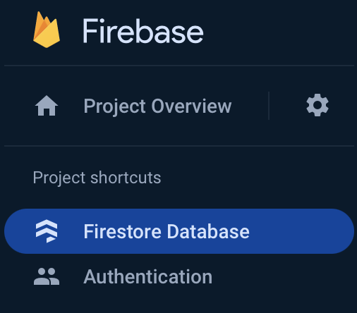
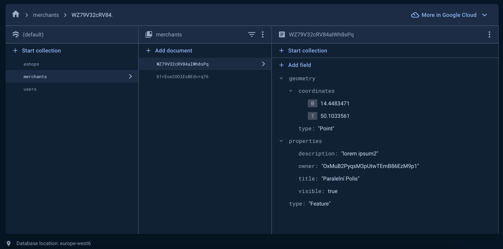

Lightning Network is de facto standard Layer 2 on the top of Bitcoin since 2019. It's possible to swap Layer 1 Bitcoin to Layer 2 for instant and cheap micropayments.  

  

 

 This opens an avenue of `using Bitcoin as a convenient payment tool` in everyday life. The question is - where to pay with Lightning Network[^1]?   
 
 There are various group of people that might be interested in such question:
 - `fans in the city visiting places` & `crypto fans accepting it`,
 - `travels` on the other side of the world and pay with Lightning,
 - internet payments for `convinience & simplicity`.

## Why Lightning map?
My idea was to aggregate such places & e-shops that accept Lightning.

My personal motivation is to:
- as a Lightning fan, I want to know where to use Lightning in Prague,
- help Prague businesses to advertise that they accept Lightning,
- add e-shops that sell goods which I am interested in,
- run biggest up-to-date website with Lightning-only places which is reliable. 

For doing that I decided to create prototype of how would such thing look like and work and maybe to show this idea to others who might be interested. I prototyped most important bare minimum functionality with easy tools. Now I only deploy frontend container to my DigitalOcean K8s for preview purposes.

#### Homepage

  

   

#### Login page (register&login / Google SSO)

  

 

#### Administration after Google SSO

  

   

#### Merchant edit

  

  

### Tech stack of MVP
For this prototype I used very straightforward set of tools (& stack) that has to be redesigned for sure. If you are interested, you can visit it [^2] and legacy GitHub repository [^3].     

Quick prototyping stack is:
- React.js (Bootstrap),
- 17$ template from ThemeForest [^4],
- MapBox,
- Firebase. 

### Peak into Firebase  
We use Firebase for simplicity. We use `document database` and `auth functionality`. Firebase is BAAS, however, the structure should be usable in other document database - namely MongoDB. Therefore, using Firebase Database is migratable and doesn't pose an obstacle.  

  

  

  

  

These things are potentially dangerous:
- React.js should better be used with MUI/RadixUI,
- Custom design has to be done,
- MapBox is expensive with traffic,
- Firebase is expensive with traffic.

The roadmap to a real project (not necessarily in that order) is: 
1. Get good design with more general targeting of Lightning topic.
2. Rewrite frontend to MUI (not necessarily full).
3. Ditch MapBox for free, yet highly customizable solution (as part of frontend works).
4. Finalize database schema - migratable `Firestore Database` to `MongoDB`
5. Provision infrastructure in `Google Cloud` via `Terraform`, which would contain managed Kubernetes, including `frontend` and `backend` workloads and managed MariaDB aside in Google Cloud. Use Firebase for bare minimum.
6. Write backend in Node.js or Go, potentially use Protocol Buffers for API definition and Istio for service mesh.
7. Ditch Firebase for data storage (! already defined final structure to avoid migrations - `merchants`, `e-shops`) and attach backend to it.
8. Deploy whole project again to Google Cloud with `backend` and `MongoDB`.
9. Explore options of using Terraform not only for `infrastructure provisioning` but also for `Kubernetes managment`, most importantly redeploys, etc.
10. Use this Terraform replicability to run tests against this piece of software at testing environment.  

Long live Lightning map!   

[^1]: https://lightning.network/lightning-network-paper.pdf
[^2]: http://lnmap.stkl.cz
[^3]: https://github.com/KlosStepan/Lightning-map/tree/KlosStepan/mvp
[^4]: https://themeforest.net/item/flatr-vcard-cv-resume-portfolio-template/21867659