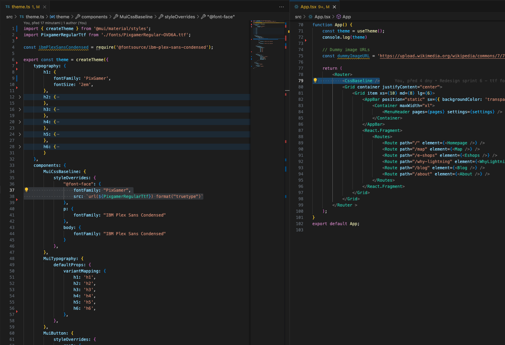

In this post I will show how to use custom fonts in Material UI for your React application.  

We will use uncommon fonts from these 2 sources:
- TrueType font (.ttf file),
- fountsource font as NPM packages.  

We use `createTheme` for styling of our web application. Watch for `PixGamer` and `IBM Plex Sans Condensed` how they are used.  
<p align="center">
  
</p> 

# TrueType font  
We must load font in `MuiCssBaseline` in `theme.js` and specify source `src` there. We then have to use `<CssBaseline />` which serves as "CSS reset" for MUI.  
Once we have these things in place, we use font in `typography`.

# fontsource font
This is way easier with no ambiguity. First install the font via npm.
```
npm i @fontsource/ibm-plex-sans-condensed
```  
We see that this font appears in your package.json
```
{
  "name": "...",
  "version": "0.1.0",
  "private": true,
  "dependencies": {
    "@fontsource/ibm-plex-sans-condensed": "^5.0.13",
    ...
```  
In `theme.js` import font before theme definition as follows
```
const ibmPlexSansCondensed = require('@fontsource/ibm-plex-sans-condensed');
```   
and then reference it around as `IBM Plex Sans Condensed`.

