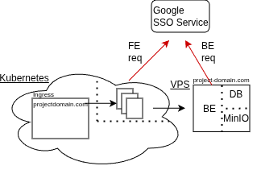
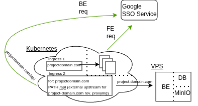

**Reverse proxy** — a single HTTP(S) entry point that accepts external requests and forwards them to one or more backend servers, handling TLS termination, load balancing, routing and cross-cutting concerns (auth, caching).

**Kubernetes** — a container orchestration system that runs in cloud and schedules Pods from declarative resources (Deployments, Services, ConfigMaps), providing service discovery, scaling and self‑healing.

**Ingress** — a Kubernetes API object that declares hostname/path → Service routing rules; an Ingress Controller (nginx/Traefik/Envoy) implements those rules and acts as the cluster’s reverse proxy.

## Why you might encounter this problem  

I recently run into an issue with my web application setup. I host most of my static / frontend content in Kubernetes - with wired in ci/cd that allows me to easily build and deploy from GitHub `main` branch of project. If backend is hosted elsewhere, you will more or less likely (allowlist of foreign adresses might alleviate to some extent) run into CORS issues. That issue was implementation of SSO via Google - which needs to be implemented both into `frontend` and `backend` sharing same address is strictly enforced by Google's policy.

## Specific setup that needs fix

As mentioned, initial setup had to be reworked to work smoothly. It does not, as a result of strict CORS policy.

## Fixed setup, masking under /api

We mask `external domain` under  `projectdomain.com/api`. New setup that we need to achieve.

## TODO //continue, Ingress 2, reapply
//  Next steps: document upstreams, add the second Ingress if needed, reapply manifests and verify the SSO flow and logging.

## Conclusion

This kind of origin mismatch is common and easily solved with a small routing layer: expose the external backend under a path (for example /api) through an Ingress so the frontend and backend share a single origin for SSO and other cookies, avoiding CORS. Using an Ingress controller to handle TLS termination, path‑based routing and header rewrites is an elegant, pragmatic composition of existing primitives.

The trade‑offs are minor — a few extra routing rules, consideration for health checks or sticky sessions, and clear mapping of upstreams — while the benefits (single origin for auth, simpler client code, centralized TLS and observability) make the approach robust and low‑friction.
