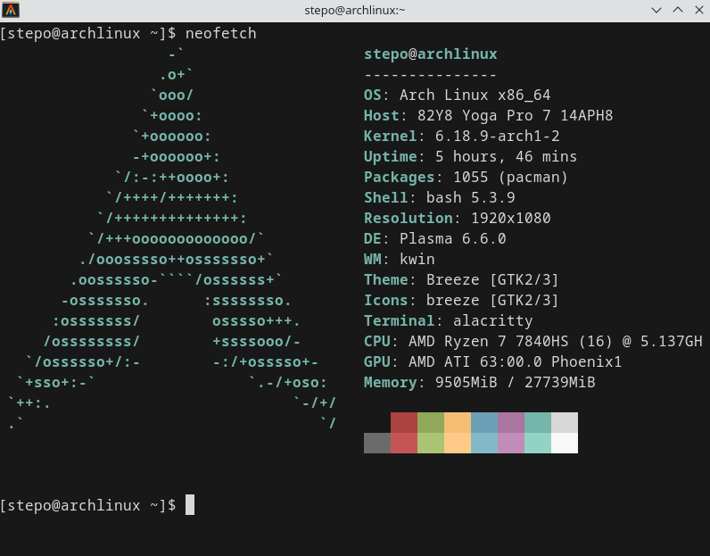

I have been using Arch Linux for 2 years and I really like it. However, there are things you have to be cautious about. Recently I've discovered that thanks to Valve's work, you can very well be gaming on Arch with AMD hardware using `proton`+`vulkan`  - this, however, has to be a separate blogpost.

I switched to Arch Linux out of desperation - after years of trying to run on distributions like Ubuntu, Kubuntu, Fedora and openSUSE.

Two years in, I can say Arch is an amazing system that runs really well. Furthermore, it taught me more about how Linux actually boots, how userspace and kernels interact.

Why a minimal, rolling distro Arch Linux `REWARDS CURIOSITY` with smoothness — and `IS RUTHLESS WHEN ONE HITS AN EDGE-CASE` breakage.

## Why I picked Arch

I wanted control and no preinstalled fluff. Arch’s installer (archinstall) was a deliberate gate: it asks you to choose and wires together only what you need. `It took me 2 days of work and approximately 10 reinstalls to get my setup right - as I wanted it.` 

That minimalism is liberating — you don’t waste time uninstalling vendor packages or fighting upstream defaults. You get a base system and then build the desktop you actually want. For me that meant a KDE desktop, a lightweight display manager, the Alacritty terminal, and Docker set up natively. `Installation includes ~ 10 basic apps (terminal, kwrite, htop, dolphin, settings, + other very basic apps). That's it.` Other apps, such as Chrome, Alacritty, Docker, are up to you to install.

## Rolling, two kernels + two display protocols

Arch’s rolling model keeps you on the bleeding edge. I run two kernel packages (mainline and LTS) so I can boot the LTS if a mainline upgrade misbehaves. 

Likewise, I have both display protocols: X11 and Wayland. Having both available removed a lot of friction — Wayland when it works is smoother and more secure, X11 when an app insists on it. The combination (two kernels + two protocols) is a pragmatic safety net: upgrade, test, fallback. `Either using old kernel, or booting into another display protocol has always worked for me.`

## BROKEN SYSTEM #1 STORY; The parts: pacman, pacman breakage, and library mismatches

Pacman is fast and predictable, and the Arch User Repository (AUR) gives access to many packages. But pacman -Syu assumes a fully consistent system — and if you force upgrades or ignore dependency conflicts, you can easily end up in a broken, partially upgraded state. I hit this when a package (electron32) required an older libxml2, while the system upgrade pulled in a newer one. Instead of resolving the conflict properly, I forced the upgrade — which left my system with mismatched libraries (e.g., libxml2.so.16 installed while binaries still expected libxml2.so.2). At that point even pacman stopped working due to missing shared libraries, and trying to “patch” it with symlinks only revealed further breakage (e.g., missing libicu versions). Recovery meant manually downloading packages from the Arch archive and extracting them with low-level tools (zstd + tar) just to restore enough of the system for pacman to run again.

When that happens, the right pattern is: treat missing .so errors as a sign of a broken system state, not something to patch. Check pacman logs, identify which packages are out of sync, and restore consistency by reinstalling or rebuilding — not by forcing versions. Avoid partial upgrades entirely, resolve AUR conflicts before updating, and only use force-installing as a last resort (with full awareness that it can break core tooling like pacman itself).

## BROKEN SYSTEM #2 STORY; Bootloaders, Ly, and the occasion of broken symlink, set bootloader parameter properly 

I use systemd-boot for a simple EFI setup (others prefer GRUB). My display manager is Ly — minimal and tightly integrated with systemd sessions, but dependent on correct binaries and session files.

After one update, Ly stopped working and dropped me to a console. The issue turned out to be a broken or missing symlink to the Ly binary in /usr/bin, likely caused by a package conflict. Restoring the symlink brought back the usual flow (Ly → KDE), but it was a reminder of how fragile minimal setups can be when something small goes missing.

Furthermore, I had to deal with GPU-related issues by adding AMD-specific kernel parameters (amdgpu) to my bootloader entries to fix early modesetting and resume problems. What made this harder than expected was not knowing my bootloader setup well enough — I wasn’t sure how to test parameters properly at first, where to persist them, or how to verify the changes.

`Takeaway is to know which bootloader you use and how it works. Test changes manually first, then make them persistent — and always verify that what you configured is actually applied. Know how diplay manager sits between display protocol and in which order are they being loaded and depend on each other.`

---

## Setup notes (how I configured the stack)

### KDE (desktop)
I chose KDE Plasma for its polish and configurability. Plasma runs as a session started by the display manager (Ly), manages Wayland or X11 sessions, and exposes system settings (Compositor, GPU backend). On Arch I installed `plasma`, `kwin`, and optional Wayland packages. For troubleshooting, I keep `plasmashell` and `kwin` logs via journalctl and a TTY login ready.

### Ly (display manager)
Ly is a lightweight TTY-based login manager that starts a user session via systemd. It’s simple and unobtrusive. Key points:
- Ly starts systemd user session which then launches the graphical session.
- Ensure your ly service is enabled (systemctl enable ly.service).
- Session files (e.g. ~/.xsession or desktop files in /usr/share/wayland-sessions) define how KDE starts under Wayland or X11.
If a symlink or binary is missing after update, boot to a TTY and reinstall/fix the package with pacman.

### Alacritty (terminal)
Alacritty is a GPU-accelerated terminal — fast and minimal. On Arch it’s installed from community or via AUR if patched. It relies on your GPU and Vulkan/GL drivers; if you switch kernels or update mesa/drivers, test Alacritty and fallback to another terminal if needed.

### tmux (terminal multiplexer) setup tl;dr:
Use named sessions (e.g., `tmux new -s NAME` or `tmux new-session -d -s NAME`) so your work persists; default prefix is `Ctrl+B` — split panes vertically with `Ctrl+B Shift+%` (horizontally with Ctrl+B "), attach with `tmux attach -t NAME` (or `tmux a -t NAME`) and detach with Prefix + d, list sessions with `tmux ls`, and kill a session with `tmux kill-session -t NAME` (or `tmux kill-server` to stop everything). Automate setups with scripts that create a detached session, build windows/panes and `tmux send-keys -t NAME 'cmd' C-m` before attaching. Consider tmux-resurrect/continuum for state restore and always prefer named sessions to avoid accidental kills.

### Native Docker (Linux only highlight)
Docker on Arch runs natively and integrates with systemd. Key things I set up:
- Install `docker` from official repos and enable `docker.service`.
- For desktop integration, add your user to the `docker` group (with care).
- Watch for kernel updates that require rebuilding kernel modules for container runtimes (e.g., overlayfs or cgroups v2 compatibility). Keeping an LTS kernel entry made container recovery easier after problematic kernel upgrades.

## Troubleshooting patterns I rely on
- Keep an LTS kernel entry and a recent boot entry in systemd-boot or GRUB.
- Use pacman logs (/var/log/pacman.log) and journalctl to trace failures.
- Use pacman -Qi and -Qo to find package ownership and file provenance.
- Rebuild AUR packages after major glibc or compiler updates.
- Document forced installs and manual library tweaks in a dotfiles/notes repo so I can reproduce or revert.
