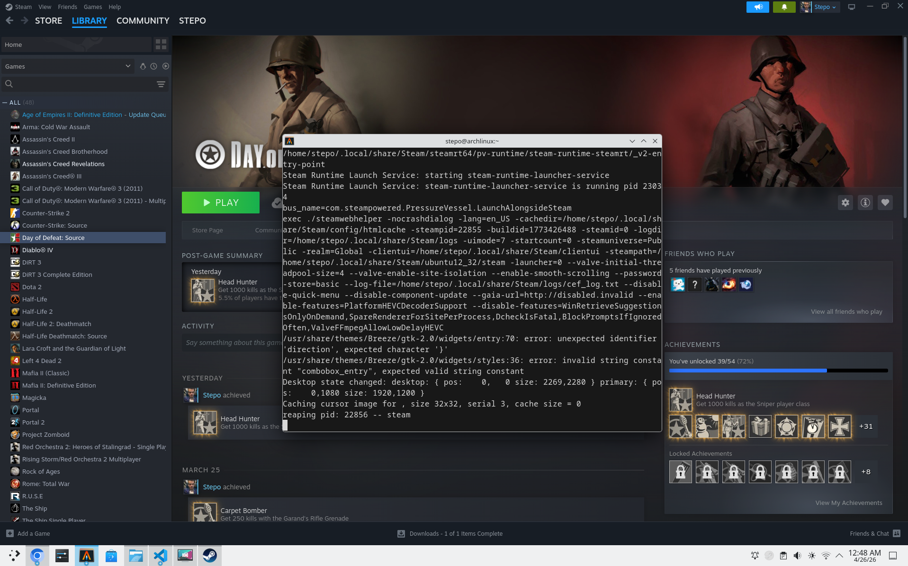

I game on Arch and this is the practical, no-nonsense guide I wish I had when I started. It covers installing Steam on Arch, Vulkan and 32‑bit support, what Proton actually does, quick Diablo IV expectations, and a handful of troubleshooting tips I used when I broke stuff.


---

## Quick summary

- Steam + Proton is the go-to path for Windows games on Linux — you usually don't need Wine or CrossOver separately.
- On Arch you must enable multilib and install 32‑bit Vulkan libs for Steam/Proton to work properly.
- Proton translates Windows calls (including DirectX) to Vulkan so your GPU speaks one modern API.
- Diablo IV is playable on a Ryzen 7 7840HS + Radeon 780M at 1080p with medium settings and FSR; native 2560×1600 will need tuning.

---

## 1. Install Steam on Arch (practical steps)

1. Enable multilib in /etc/pacman.conf (uncomment these lines):
   - [multilib]
   - Include = /etc/pacman.d/mirrorlist

2. Update and install Steam + 32‑bit Vulkan driver for AMD:
```bash
sudo pacman -Syu
sudo pacman -S steam lib32-vulkan-radeon
```

If you prefer sandboxed installs, Flatpak is an alternative:
```bash
flatpak install flathub com.valvesoftware.Steam
flatpak run com.valvesoftware.Steam
```

See my other Arch notes for context: [content/blog/16-arch-linux-for-2-years/index.md](content/blog/16-arch-linux-for-2-years/index.md).

---

## 2. What Vulkan and 32‑bit libs do (short)

Vulkan is the low‑level graphics API that gives your GPU efficient control and low overhead. Proton and DX→Vulkan shims (DXVK / VKD3D‑Proton) translate DirectX calls into Vulkan, so games that expect Windows graphics APIs can run on Linux. Steam and many Windows games still require 32‑bit userland components, so on x86_64 Linux you must install lib32 drivers (e.g., lib32‑vulkan‑radeon for AMD) for graphics and Proton to work.

---

## 3. Proton in one paragraph

Proton is Valve’s compatibility layer (Wine + a collection of graphics shims and patches). When Steam runs a Windows game through Proton it intercepts Windows system calls, maps or translates them (filesystem, DirectX, input, sound), and uses DXVK / VKD3D to route GPU calls to Vulkan. Proton is bundled with Steam and manageable per‑game; use Proton Experimental for the newest fixes or install community builds via protonup tools.

---

## 4. Diablo IV on Arch — realistic expectations

Your machine (Ryzen 7 7840HS, RDNA3 Phoenix / 780M, 28 GB RAM) is closer to Diablo IV recommended than minimum:

- At 1080p: expect medium settings → 50–60 FPS with FSR; high → 40–55 FPS depending on scenes.
- At native 2560×1600: target medium + FSR for stable 45–60 FPS; disable ray tracing.
- CPU & RAM are more than enough; GPU is the limiting factor but performs strongly for an iGPU.

Run Diablo IV through Proton (Steam Play → enable for all titles) or use Lutris/Battle.net setups if you want the non‑Steam client.

---

## 5. Quick setup checklist (copy‑paste)

1. Enable multilib → sudo pacman -Syu  
2. Install Steam + Vulkan 32‑bit for AMD:
```bash
sudo pacman -S steam lib32-vulkan-radeon
```
3. Launch Steam, Settings → Compatibility → enable Steam Play (choose Proton Experimental or latest).
4. (Optional) Manage Proton versions with protonup:
- Flatpak: net.davidotek.pupgui2
- AUR: protonup-qt (install after you have a working AUR helper)
5. If a game needs extra tweaks, try forcing a Proton version in game Properties → Compatibility.

---

## 6. Troubleshooting notes (short)

- Steam fails to start: ensure en_US.UTF-8 locale exists and lib32 drivers installed.
- Vulkan test: install vulkan-tools and run `vulkaninfo`.
- If an AUR helper breaks after pacman upgrades, rebuild it from source (the libalpm library mismatch case I hit).
- For anti‑cheat games: some require specific glibc/patches — Proton Flatpak/runtime vs system runtime can matter.
- When a game is unstable, try Proton Experimental, GE, or a different VKD3D/DXVK version.

---

## 7. Do I need Wine / CrossOver / Lutris?

- Most Steam games: no — use Steam + Proton.
- Non‑Steam Windows games or custom launchers: Lutris or Wine may be useful.
- CrossOver is a commercial Wine build — rarely necessary unless you want paid support or specific integration.

---

## 8. Useful commands

- Check GPU + driver: `lspci -k | grep -A3 -E "(VGA|3D)"`
- Vulkan info: `vulkaninfo | less` (install vulkan-tools)
- Verify 32‑bit lib: `pacman -Qs lib32-vulkan`
- Rebuild an AUR helper: clone aur repo → `makepkg -Csi`

