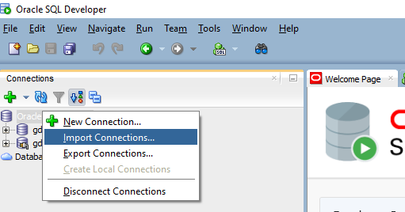
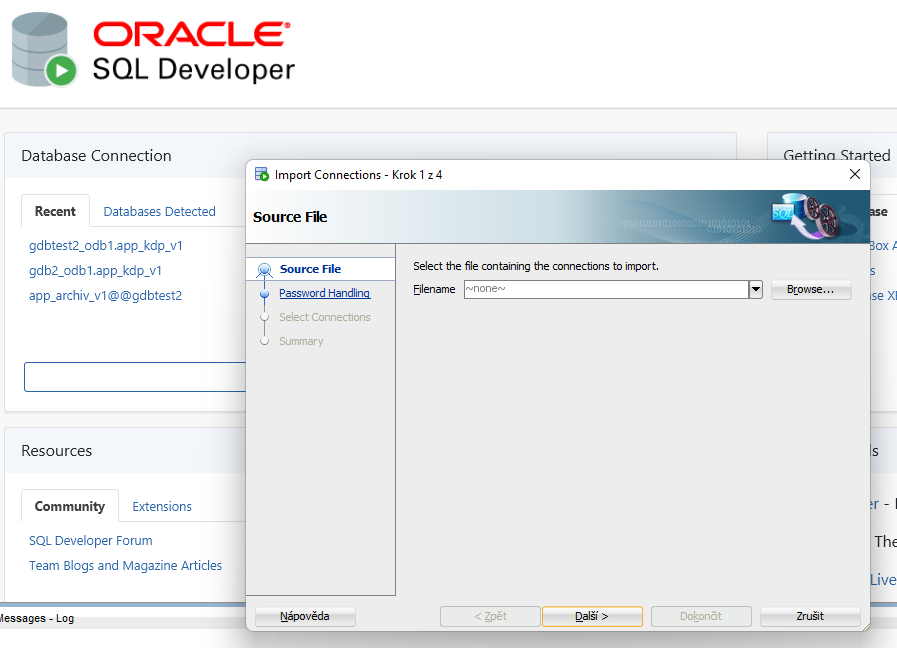
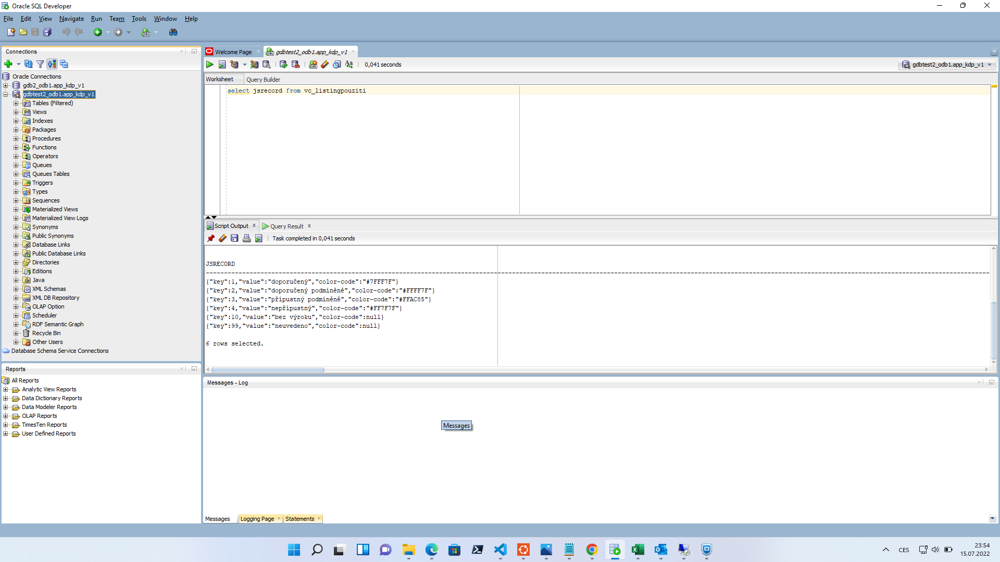
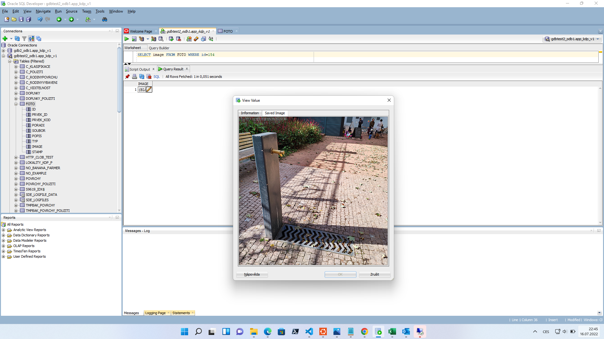
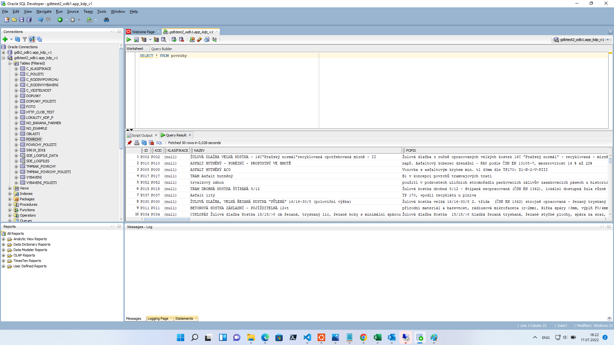
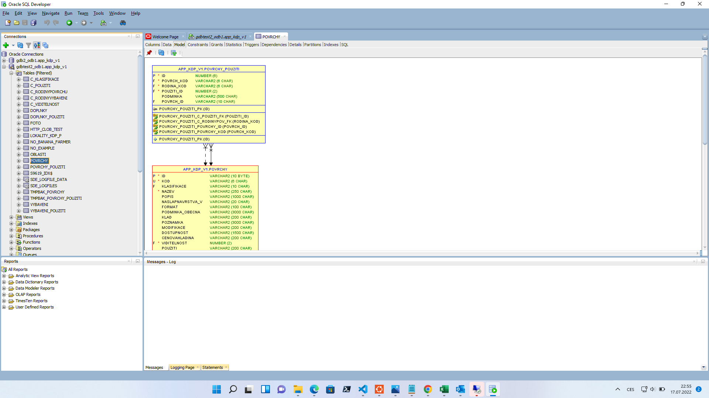
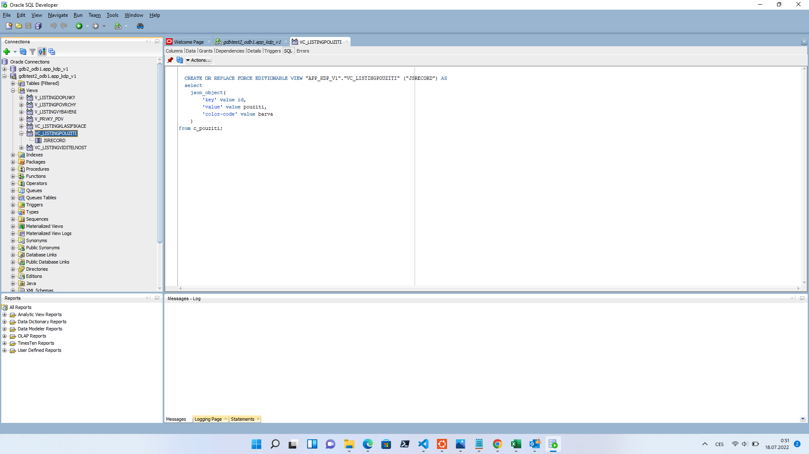

In this post we will lay out possibilities of using Oracle Database and it’s specific features to facilitate process of creating your application. Oracle Database is a typical database managment system commercially developed by Oracle Corporation. Compared to MySQL, or rather it’s opensource implementation MariaDB, Oracle databases come with several perks that make working with it easier. Some of them will be described in post along with other programmer experiences and examples of use.

We will show how to construct `REST APIs` serializing via JSON with Node.js and perform majority of the backend work in the Oracle database, `how to store images in a binary format` to avoid hassle with pictures on filesystem and temporary images and we will provide general tips and overview of Oracle SQL Developer. If you are considering using Oracle database, or actually are in position that you have to, this post might be an inspiration or a quick overview of some experiences and crafted working solutions that might be useful or you might actually use.

# Tools and software
We are using these parts and tools:
- `Oracle 18.3` on server,
- `ORACLE SQL Developer` 21.4.3,
- `node-oracledb` 5.3.0,
- `tools and features` facilitating our development and working.

# Initial steps and setups
So we prepare ourselves by unzipping the newest version of `sqldeveloper` in our computer. Then we open it and right click `Import Connections` select encrypted json file with connector to our database provided by our collegues or us (if we created the database previously).
<p align="center">
  
</p>  

We navigate the `import connection` manager and fill out optional password to the connection file (if needed). By following this form we will have created created authorized Oracle Connections to our database(s).
<p align="center">
  
</p>

Once we are ready, we see that solution automatically comes with `production database` and `test database`. We will be working strictly on the test database until we’re ready to ship tested aplication to production. After loading we can see various database related things on the left side, most importantly `Tables, Views, Procedures, Functions` and other stuff. We will go through these items and show some Oracle features such as BLOBs and native inserts/selects with json_object for "ORM-like" interfacing with database.
<p align="center">
  
</p>

# Interfacing with Oracle Database from Node.js
Oracle Database will be used for a web application. We need to connect to our database with` Node.js as a client language for backend`. There are several things which are different from "typical PHP-MySQL connection" which is (former) de facto status quo in the web development. To deliver REST API we need to:
- install `oracledb` package via npm,
- `serialize listings` in database for backend,
- `send desired responses` on HTTP REST endpoints. 

After we install oracledb, we need to connect to the database. For such task, we create object with username, password and a connector line which is not going to be in GIT repo for security reasons. We include use this object as an argument for connection.

file `_dbCreds.js`
```javascript
module.exports = {
user: ’user’, password : ’passwd’ ,
connectString : "(DESCRIPTION=(ADDRESS_LIST=(FAILOVER=true)
    (LOAD_BALANCE=false)(ADDRESS=(PROTOCOL=TCP)(HOST=HHHH)
    (PORT=PPPP))(ADDRESS=(PROTOCOL=TCP)(HOST=HHHH)
    (PORT=PPPP)))(CONNECT_DATA=(SERVICE_NAME=SSSS)))"
}
```
file `dbConn.js`
```javascript
const oracledb = require(’oracledb’); const dbCreds = require("./_dbCreds");
let database = null ;
async function startDatabase () {
    database = await oracledb.getConnection(dbCreds)
}
async function getDatabase () {
    if (! database) await startDatabase ();
    return database ;
}
module.exports = {
    getDatabase,
    startDatabase
};
```

Noteworthy item here is the `connectionString` which must be included to specify connection creds. Then we can execute queries thanks to classes as follows:
```javascript
const { getDatabase } = require("./dbConn");
async function f () {
    let connection = await getDatabase ();
    let query = "select ... from view"
    result = await connection.execute(query);
}
```

# Construction of REST API

We will outline several types of endpoints which are needed not only in our applicaton but in general. Some of ours, however, utilise serialization of SELECT via json_object in Oracle Database, some send picture from assembled bytestream from database BLOB, some server for insertions, etc.

## Listing REST endpoint - GET /
Most straightforward is endpoint providing listing of elements. These endpoints return `View` (with joined lists from other table affiliated) and returns entries as JSON thanks to json_object.

`select * from v_listingvybaveni`
```sql
  CREATE OR REPLACE FORCE EDITIONABLE VIEW "APP_KDP_V1"
  ."V_LISTINGVYBAVENI" ("JSRECORD") AS
  with vp as (
    select
        vybaveni_id
        , '[' || listagg('{"rodina_kod":"' || rodina_kod
         || '", "pouzitiId":' || pouziti_id || '}',', ')
          WITHIN GROUP (ORDER BY rodina_kod) || ']' vybaveniPouziti
    from vybaveni_pouziti
    group by vybaveni_id
),
f as(
    select
        prvek_id
        , '[' || listagg('{"fotoId":'|| id ||'}',', ')
          WITHIN GROUP (ORDER BY poradi) || ']' foto
    from foto
    group by prvek_id  
)
select json_object(
        'id' value v.id,
        'kod' value v.kod,
        'design' value v.design,
        'nazev' value v.nazev,
        'popis' value v.popis,
        'ergonomie' value v.ergonomie,
        'material' value v.material,
        'servis' value v.servis,
        'certifikat' value v.certifikat,
        'modifikace' value v.modifikace,
        'dostupnost' value v.dostupnost,
        'cenovahladina' value v.cenovahladina,
        'viditelnost' value v.viditelnost,
        'vybaveniPouziti' value vp.vybaveniPouziti format json,
        'foto' value f.foto format json
    )
from vybaveni v
left join vp on vp.vybaveni_id = v.id
left join f on f.prvek_id = v.id;
```

## Image backend service via BLOB - GET /id
We store images in database in BLOBs and have endpoint which will deliver upon request. This is the function to retrieve and return BLOB.

`"photo for backend" function`
```sql
async function retrieveFotoById(req, res, fotoId) {
  let connection;
  try {
    connection = await getDatabase();
    const result = await connection
    .execute("SELECT image FROM FOTO WHERE id='"+fotoId+"'");
    if (result.rows.length === 0) {
      throw new Error("No data selected from table.");
    }
    const lob = result.rows[0][0];
    if (lob === null) {
      throw new Error("BLOB was NULL");
    }
    const doStream = new Promise((resolve, reject) => {
      lob.on('end', () => {
        res.end();
      });
      lob.on('close', () => {
        resolve();
      });
      lob.on('error', (err) => {
        reject(err);
      });
      res.writeHead(200, {'Content-Type': 'image/jpeg' });
      lob.pipe(res);  // write the image out
    });
    await doStream;
    connection = null;
  } catch (err) {
    console.error(err);
    await closePoolAndExit();
    } finally {
    if (connection) {
      try {
        await connection.close();
      } catch (err) {
      console.error(err);
      }
    }
  }
}
async function closePoolAndExit() {
  try {
    await oracledb.getPool().close(2);
    process.exit(0);
  } catch (err) {
    console.error(err.message);
    process.exit(1);
  }
}
```
Selected image get streamed with header to client via backend as a HTTP response. Preview of parametrized query is possible to be viewed in SQL Developer even with "image representation of bytestream" - which in this case is a JPEG image.
<p align="center">
  
</p>

Application endpoint for image, therefore, returns an image, which in reality doesn’t even have to occupy a space as a file on server’s filesystem, which for dummy previews like these is very elegant way of simplifying application.  

Requests, thus can arrive as responses from `kdp.ipr.praha.eu/api/foto/154` and can be placed into HTML img source tag directly. Backend side of things is as straightforward as one would expect. Function `retrieveFotoById(params)` was described above for sending HTTP headers and streaming picture’s by- testream. 

`index.js` of Node.js express backend, with app being instance of Express 10 running on sbds.domain.tld/`api`
```javascript
app.get(’/foto/:fotoId’, async(req, res) => {
    res.send( await retrieveFotoById(req, res, req.params.fotoId))
})
```
`DisplayFoto.jsx` function component on React.js frontend
```javascript
import URLEndPointBE from ’./ URLEndPointBE’
function DisplayFoto (props) {
    const fotoEndpoint = URLEndPointBE + ‘/foto‘
    return (
        <span>
    )
}
export default DisplayFoto
```
# Oracle SQL Developer description
Going back to Oracle SQL Developer, there are some noteworthy things that have to be said about features and functions. These features facilitate process of working on database or viewing the data or even fiddling with it.

## Worksheet section
After opening Oracle SQL Developer and connecting to one database, a `Welcome page` pops up. It is notebook-worksheety tool, to execute SQL queries that are not necessarily affiliated to any specific part. One can, however, run queries or SQL statements to create functions or preform whatever actions that do (not) modify database structure/content.

Looking up, you can either `Run Statement (Ctrl+Enter)` or `Run Script (F5)` which differ in the readability of output, run statement returns aw data but run script returns you more verbous human-readable output.

<p align="center">
  
</p>

## Table Model 
Visualized realtions of selected table with other tables.
<p align="center">
  
</p>

## Views SQL code example 
Views editation preview in Oracle SQL Developer - img here, selection query as well.
<p align="center">
  
</p>

___
Some terms & `technical things` used in this text to the assemble application.
- `NPM`: Run `npm install oracledb` for https://www.npmjs.com/package/oracledb.
- `CONNECTION STRING`: For more information https://docs.oracle.com/database/121/ODPNT/featConnecting.htm#ODPNT166.
- `JSON_OBJECT`: More about json_object https://docs.oracle.com/en/database/oracle/oracle-database/12.2/sqlrf/JSON_OBJECT.html#GUID-1EF347AE-7FDA-4B41-AFE0-DD5A49E8B370.
- `BLOB`:  https://docs.oracle.com/database/121/TDPPH/ch_twelve_blobs.htm#TDPPH183.