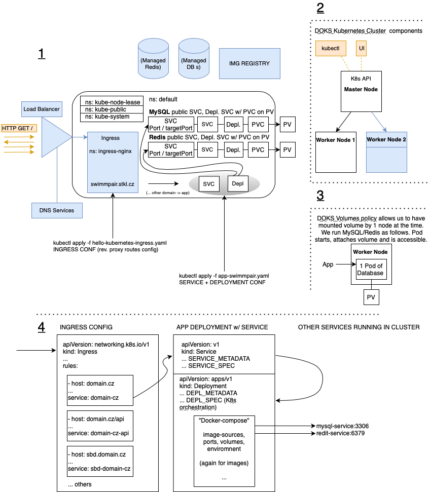

Description of our DOKS setup and tools/applications w/ configurations and brief tutorials.

# Setup Overview

We use [DigitalOcean Managed Kubernetes](https://www.digitalocean.com/products/kubernetes) (in Amsterdam Datacenter 3/AMS3).  
The setup is following:
- Kubernetes Cluster w/ `2 Node` workers `s-1vcpu-2gb-intel`
- `DigitalOcean Load Balancer` for accepting traffic - incoming HTTP requests,
- `Ingress Controller` w/ nginx for routing traffic within Cluster into Kubernetes Services.

We use [**Kubernetes Dashboard**](https://github.com/kubernetes/dashboard), [**Lens**](https://k8slens.dev/desktop.html) (via `kubectl`) and [**kubectl**](https://kubernetes.io/docs/tasks/tools/) for monitoring and adminsitration.  

Majority of application administration is performed by applying config files in following manner.
```
kubectl apply -f kubernetes-ingress-config.yaml
```
Overview is carried on either in GUI or by querying via kubectl. 
```
kubectl get nodes
```
```
kubectl get deployments
```
```
kubectl describe ingress hello-kubernetes-ingress
```

# Our K8s cluster overview
1. Cluster Visualization - blue components are either external (DNS Services, Load Balancer / DBs or Image Registry) or added to the cluster later (Ingress). It shows architecture of `MySQL` & `Redis` databases in cluster and one PHP app utilizing it. Orange color is used for external communication/traffic.
2. Running cluster architecture - 1 DOKS (Master) & 2 Nodes (2nd+ nodes are optional - therefore blue).
3. DOKS Volume policy - 1 Volume can be attached to just 1 Node at the time. We show how to run 1/1 Replica databases, which is sufficient for simple usecase like ours. You can use Managed by cloud provider ones.
4. YAML config file - basic example schema.  


# Tools running in K8s cluster
- `Load Balancer` - Managed Load Balancer by DO outside of cluster. 
- `Ingress` - (1-Click apps/Helm) w/ `nginx`.
- `MySQL Deployment` - MySQL Database Server in K8s Cluster.
- `Adminer` - (adminer Docker image Deployment) Adminer GUI client for browsing DBs running on mysql-service.
- `Redis Deployment` - `Re`mote `Di`ctionary `S`erver in K8s Cluster.
- `Cert Manager` - (1-Click apps/Helm) for HTTPS.
- `Web applications` - Several LAMP/JS web applications.
# Kubernetes Objects - general basic must-know
## Cluster Architecture
- Nodes - Master Node, Worker Nodes, (The Kubernetes API)
## Workload
- Deployments - define Pods and ReplicaSets
## Services, Load Balancing, and Networking
- Ingress
- Service (port, targetPort)
## Storage
- Volume - Persistent Volume
- Persistent Volume Claim
## Configuration
- Secret
## Tasks
- HorizontalPodAutoscaler - attached to Deployment
