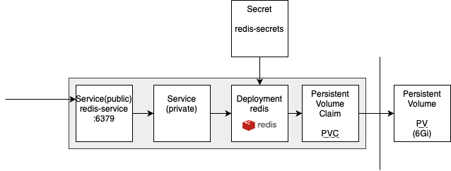
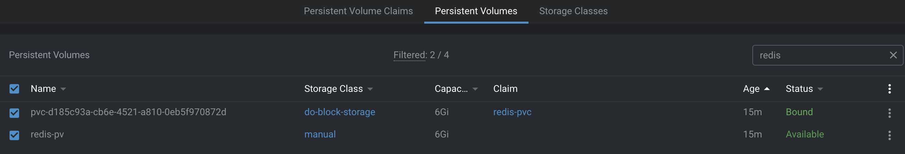
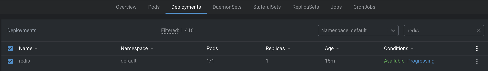
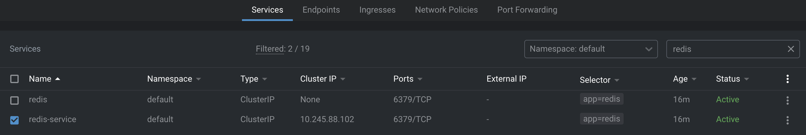
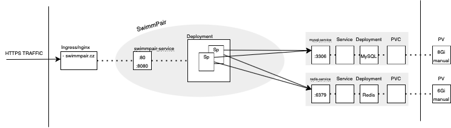

# Install Redis to K8s Cluster
Follow these steps to achieve desired functionality like previously shown in 
[**mysql-deployment**](https://github.com/KlosStepan/DOKS-tutorial/tree/main/mysql-deployment).  
Used image of Redis https://hub.docker.com/_/redis has to be wrapped in the similar manner and exposed as `redis-service:6379`.  

This tutorial shows cluster overview by [**Lens**](https://k8slens.dev/desktop.html) (via kubectl) rather than raw [**kubectl**](https://kubernetes.io/docs/tasks/tools/) CLI.
<p align="center">
  
</p>

## 0. Generate base64 password & apply Kubernetes Secret
Generate base64 password and place it into redis-secret file.  

script `0-encode-base64.zsh`
```zsh
#!/usr/bin/zsh
echo -n $1 | base64
```
k8s object `0-redis-secret.yaml`
```yaml
apiVersion: v1
kind: Secret
metadata:
  name: redis-secrets
type: Opaque
data:
  REDIS_PASSWORD: cGFzc3dvcmQ=
```
terminal i/o for this step
```zsh
chmod u+x 0-encode-base64.zsh 
zsh 0-encode-base64.zsh password 
cGFzc3dvcmQ=
kubectl apply -f 0-redis-secret.yaml 
secret/redis-secrets created
```
## 1. Create PV & and make PVC on it
k8s Persistent Volume and Persistent Volume Claim `1-pv-pvc-redis.yaml`
```yaml
apiVersion: v1
kind: PersistentVolume
metadata:
  name: redis-pv
  labels:
    type: local
spec:
  storageClassName: manual
  capacity:
    storage: 6Gi
  accessModes:
    - ReadWriteOnce
  hostPath:
    path: "/mnt/data/redis"
---
apiVersion: v1
kind: PersistentVolumeClaim
metadata:
  name: redis-pvc
spec:
  accessModes:
    - ReadWriteOnce
  resources:
    requests:
      storage: 6Gi
  storageClassName: do-block-storage
```
terminal
```zsh
kubectl apply -f 1-pv-pvc-redis.yaml  
```
result in Lens 
<p align="center">
  
</p>

## 2. Create Service (internal) & Deployment  
internal service and deployment  `2-deployment-redis.yaml`
```yaml
apiVersion: v1
kind: Service
metadata:
  name: redis
spec:
  ports:
  - port: 6379
  selector:
    app: redis
  clusterIP: None
---
apiVersion: apps/v1 # for versions before 1.9.0 use apps/v1beta2
kind: Deployment
metadata:
  name: redis
spec:
  replicas: 1
  selector:
    matchLabels:
      app: redis
  strategy:
    type: Recreate
  template:
    metadata:
      labels:
        app: redis
    spec:
      containers:
      - name: redis
        image: redis
        command: ["redis-server"]
        args:
        - "--save"
        - "20"
        - "1"
        - "--loglevel"
        - "warning"
        - "--requirepass"
        - "cGFzc3dvcmQ="
        #args:
        #  - "--requirepass"
        #  - "${REDIS_PASSWORD}"
        ports:
        - containerPort: 6379
        volumeMounts:
        - name: redis-data
          mountPath: /data
      volumes:
      - name: redis-data
        persistentVolumeClaim:
          claimName: redis-pvc
```
terminal
```zsh
kubectl apply -f 2-deployment-redis.yaml 
```
result in Lens
<p align="center">
  
</p>

## 3. Create Service (public) - link the internal one
public service `3-service-redis.yaml`
```yaml
apiVersion: v1
kind: Service
metadata:
  name: redis-service
spec:
  selector:
    app: redis
  ports:
  - protocol: TCP
    port: 6379
    targetPort: 6379
```
terminal
```zsh
kubectl apply -f 3-service-redis.yaml   
```
result in Lens
<p align="center">
  
</p>

___
## Where/how to use Redis
Redis should be running on `tcp://redis-service:6379?auth=PASSWD`  
Both `MySQL` and `Redis` are were tested on multireplica deployment of our LAMP application SwimmPair.  
Peek. Visualization on how containers share databases - which have both persistent storage. Database for obvious purposes, Redis for keeping sessions live in case of reboots or death of all containers.  
<p align="center">
  
</p>
They run at usable for other applications:

- mysql-service:3306,
- redis-service:6379.

We, however, have to change php.ini to adjust PHP for using Redis for session handling as follows:
```php
session.save_handler: 'redis'
session.save_path: 'tcp://redis:6379?auth=aGVzbG8='
```
Our docker image [thecodingmachine/php:7.2-v4-apache](https://github.com/thecodingmachine/docker-images-php) has way how to override these params via [ENV VARIABLES](https://www.twilio.com/blog/2017/01/how-to-set-environment-variables.html). Both `docker-compose` and `Kubernetes Deployment` have same notation.
```yaml
    environment:
      PHP_INI_SESSION__SAVE_HANDLER: 'redis'
      PHP_INI_SESSION__SAVE_PATH: 'tcp://redis:6379?auth=aGVzbG8='
```
After that we should be able to call `phpinfo();` to see `session.save_handler` and `session.save_path` set up as mentioned above.